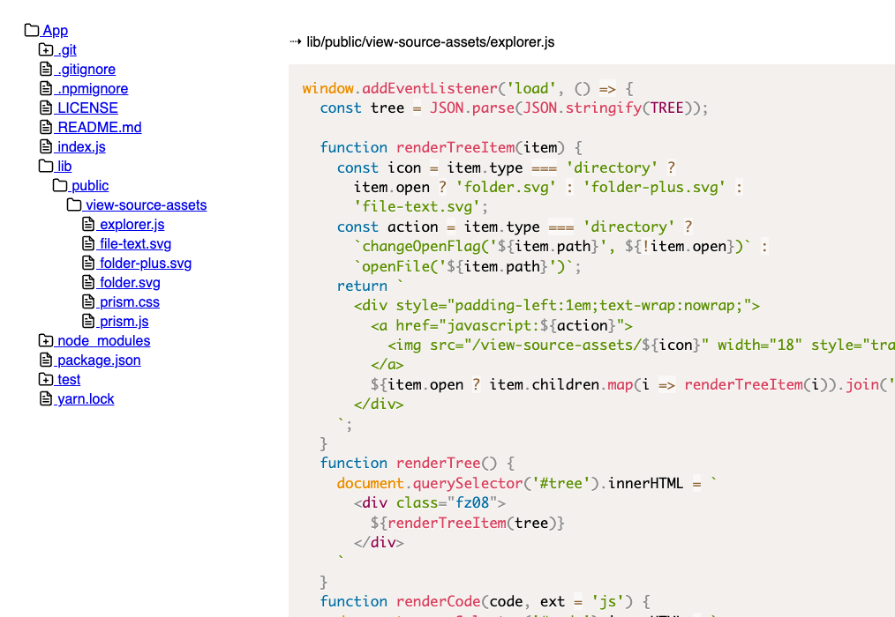

# view-source

An Express.js add-on to render source code. Use it if you need to show source code of a project over the web.

## Usage

Install it via `npm i view-source` (or `yarn add view-source`). Then the following:

```js
const express = require('express');
const { viewSource } = require('view-source');

const app = express();

viewSource({
  appTitle: 'My App Name',
  app,
  route: '/code',
  source: __dirname + '/../'
});
```

Where `route` is the path from which you'll access the viewer and `source` is the actual physical place where the files are located.
